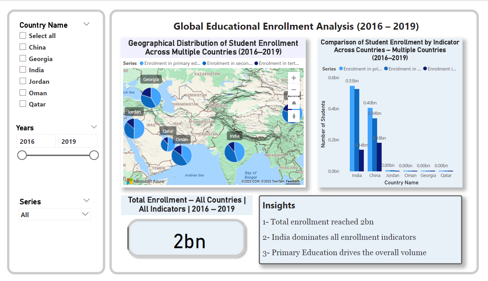
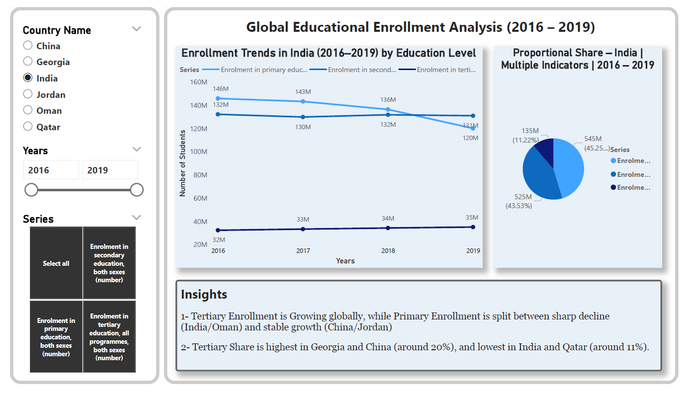

# Educational Enrollment Analysis Across Selected Countries


An interactive Power BI dashboard for exploring educational enrollment patterns across **China, Georgia, India, Jordan, Oman, and Qatar** between **2016 and 2019**. The project transforms World Bank education data into a clear two-page analytical experience with dynamic titles, cross-filtering, country and education-level comparisons, and concise insights.

## Dashboard Preview

### Global Overview and Geography



### Trend and Distribution Analysis



## Project Objective

The dashboard was designed to answer four practical questions:

- How does enrollment differ across the selected countries?
- How are students distributed across primary, secondary, and tertiary education?
- How did enrollment change from 2016 to 2019?
- Which countries show the strongest growth or decline within each education level?

## Dashboard Features

- **Two analytical pages:** overview and detailed trend analysis
- **Interactive slicers:** country, year, and education indicator
- **Geographic analysis:** bubble map for comparing enrollment by country
- **Comparative analysis:** clustered column chart across countries and education levels
- **Trend analysis:** line chart for year-over-year changes
- **Distribution analysis:** pie chart for proportional enrollment share
- **Dynamic titles:** DAX measures update visual titles according to the active filters
- **Cross-filtering:** selections interact across visuals for focused exploration

## Data Preparation

The source data was prepared in Power Query before visualization:

1. Converted enrollment values to numeric data types.
2. Reshaped year columns into a normalized structure suitable for analysis.
3. Handled three missing values using the mean of the corresponding country row to preserve the dataset's geographic context.
4. Standardized the country, year, education indicator, and student-count fields.
5. Validated the cleaned dataset before building the report model.

## Key Insights

- India records the highest combined enrollment across the selected countries.
- China records the highest tertiary enrollment.
- Tertiary enrollment increases across the selected countries during the analyzed period.
- Primary enrollment declines in India and Oman, while China and Jordan show steady growth.
- Georgia and China have the highest tertiary enrollment shares at approximately 20%.
- India and Qatar have the lowest tertiary enrollment shares at approximately 11%.

> Insights reflect the six selected countries and the 2016–2019 period; they should not be interpreted as global conclusions.

## Repository Structure

```text
├── assets/
│   ├── dashboard-overview.png
│   └── dashboard-detailed-analysis.png
├── dashboard/
│   └── educational-enrollment-dashboard.pbix
├── data/
│   └── educational-enrollment-cleaned.xlsx
├── report/
│   ├── educational-enrollment-analysis-report.docx
│   └── educational-enrollment-analysis-report.pdf
└── README.md
```

## How to Explore the Project

1. Download the `.pbix` file from the `dashboard` folder.
2. Open it using **Microsoft Power BI Desktop**.
3. Use the country, year, and education-indicator slicers to explore the visuals.
4. Review the full methodology and visual explanations in the `report` folder.

## Tools and Skills Demonstrated

- Microsoft Power BI
- Power Query
- DAX measures
- Data cleaning and transformation
- Interactive dashboard design
- Exploratory data analysis
- Data visualization and insight communication

## Data Source

The dataset was obtained from **World Bank Open Data – Education Statistics** and contains enrollment indicators for primary, secondary, and tertiary education.

## Author

**Mariam Abu Sawwa**  
Data Scientist | AI Developer | Flutter Developer

[GitHub](https://github.com/mariamsawwa12) · [LinkedIn](https://www.linkedin.com/in/mariam-abusawwa-ba935030b/)

